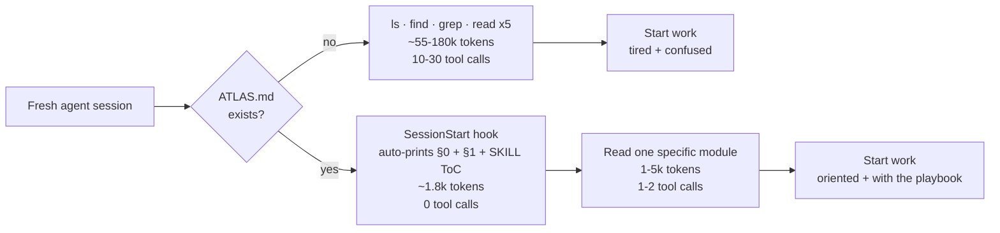

# ATLAS — Agentic Harness Standard — for better multi agents performance, agents token and context reduction by design, graph based. Zero infrastructure. 

> ## −92% agent orientation tokens (12.8×) — *measured, not claimed*. Up to −99% on whole-repo loads; bigger on larger repos.
>
> Stop your agents from burning **100k+ tokens per session** on `ls`, `find`, `grep`, and `git ls-files` just to figure out where things live. **Four Markdown files** ship the project map, the task playbook, the scar memory, and the behavior contract into context **before the first tool call** — every Claude / Codex / Cursor / Gemini / Zed / OpenCode / Copilot / Hermes session.
>
> Not a claim — **[benchmarked + logged](docs/benchmarks/RESULTS.md)**: 12.8× (92%) on this very repo, reproducible with `atlas bench`.
>
> **Don't grep. Don't guess. Don't repeat.**

<p align="center">
  
</p>

<p align="center">
  <a href="docs/benchmarks/RESULTS.md"></a>
  <a href="docs/benchmarks/RESULTS.md"></a>
  <a href="#install--pick-your-flavor"></a>
</p>

<p align="center">
  
</p>

<p align="center">
  <a href="https://github.com/Abbasi-Alain/atlas/stargazers"></a>
  <a href="https://github.com/Abbasi-Alain/atlas/network/members"></a>
  <a href="https://github.com/Abbasi-Alain/atlas/graphs/contributors"></a>
  <a href="LICENSE"></a>
  <a href="https://github.com/Abbasi-Alain/atlas/actions"></a>
  <a href="https://doi.org/10.5281/zenodo.20766338"></a>
</p>

<p align="center">
  <a href="https://www.npmjs.com/package/@alainabbasi/atlas"></a>
  <a href="https://www.npmjs.com/package/@alainabbasi/atlas"></a>
  
  
  
  
  
  
</p>

---

## The 30-second pitch


| Metric                                    | Without ATLAS     | With ATLAS                  | Reduction  |
| ----------------------------------------- | ----------------- | --------------------------- | ---------- |
| **Orientation tokens per session**        | 55–180k           | ~1.8k auto + 1–5k on demand | **12.8× [measured](docs/benchmarks/RESULTS.md)** |
| **Orientation tool calls**                | 10–30             | **0**                       | ∞×         |
| **Same bug re-introduced**                | every fresh agent | never (cite `§ANCHOR`)      | —          |
| **"While I'm here" cleanup churn in PRs** | high              | 30–60% lower *(est.)*       | —          |
| **Infrastructure required**               | —                 | **none** (4 Markdown files) | —          |
| **Runtimes supported**                    | varies            | **9** out of the box        | —          |


ATLAS is **a harness performance tool disguised as documentation**. Three files. No daemon, no DB, no service to run, no SDK to wire. Works with whatever agent runtime your team picked, and the next one.

---

## Why now

Three things are exploding at once:

1. **Context windows are growing, but tokens-per-task keep rising faster.** A 1M-token context isn't the answer if every fresh agent spends 100k of it on `ls` / `find` / `grep` before doing real work.
2. **Multi-agent dispatch is becoming default.** Lead agents spawn sub-agents (Claude Code's Task tool, Cursor's Background Agents, Codex worker mode, ECC squads, Manus, Replit Agent). Each sub-agent re-pays the orientation tax. ATLAS amortises it.
3. **AGENTS.md is becoming a real standard.** Codex / OpenCode / Cursor / Gemini / Zed all read AGENTS.md-style files at session start. ATLAS gives that file the shape that maximizes its value — not just behavior rules, but a real map.

## How it works *(in 30 seconds)*



The hook fires once per session, before the agent's first action.

---

## The quartet *(four files. that's it.)*


| File                                                              | Axis           | Question it answers                                                                                                                                                                           | Token cost              |
| ----------------------------------------------------------------- | -------------- | --------------------------------------------------------------------------------------------------------------------------------------------------------------------------------------------- | ----------------------- |
| `[ATLAS.md](templates/ATLAS.md.tmpl)`                             | **Structural** | *Where is X?* Graph index — every important module, its role, what it talks to. Plus glossary, data model, external deps, runtime topology, observability, security boundaries, build/deploy. | ~1.4k auto-loaded §0+§1 |
| `[SCARS.md](templates/SCARS.md.tmpl)`                             | **Failure memory** | *What did we learn the hard way?* Stable anchors (`§NAME-LIKE-THIS`) — symptom → root cause → do NOT → do → file pointer. Cite from PRs and commits.                                     | ~0.4k ToC auto-loaded   |
| `[.agents/skill/<project>/SKILL.md](templates/SKILL.md.tmpl)`     | **Procedural** | *How do I do X here?* Task recipes — goal → steps → how to verify.                                                                                                                            | on-demand               |
| `[CLAUDE.md](templates/CLAUDE.md.tmpl)` + `[AGENTS.md](#)` mirror | **Behavioral** | *How should the agent act?* Don't assume. Don't refactor adjacent code. Match existing style. Define success criteria. Loop until verified.                                                   | on-demand               |


Plus `[EXAMPLES.md](templates/EXAMPLES.md.tmpl)` — vague→concrete transformations that teach the patterns by contrast.

**Net:** ~1.8k tokens of project orientation lands in the agent's context **before the first tool call**, eliminating 10–30 redundant `ls`/`find`/`grep`/`read` round trips per session.

---

## Benchmarks — measured, not just claimed

ATLAS ships an A/B benchmark (`atlas bench`) and appends every run to a
[ledger](docs/benchmarks/RESULTS.md) so the reduction is trackable across
versions, models, and dates. First result on **this repo** (deterministic, reproducible) —
the reduction is a *range*, set by how the agent would otherwise orient:

| "Without ATLAS" orientation | tokens | vs the spine |
|---|---|---|
| Whole-repo dump (RAG / "load everything") | 104,390 | **−99% · 80×** |
| Smart skim (README + file tree + source heads) | 16,571 | **−92% · 12.8×** |
| ATLAS §0–1 spine (auto-injected before the first tool call) | 1,297 | — |

`atlas measure` prints this range for any repo; the `atlas bench` ledger logs the
**−92%** (the conservative, fair-fight baseline — not the whole-repo strawman).

```bash
# any OpenAI-compatible endpoint (incl. a local vLLM), free + deterministic:
atlas bench --runtime openai --api-base http://localhost:8000/v1 --model <model>
# or a live agentic A/B with a real coding agent:
atlas bench --runtime claude   # or codex | opencode
```

The skim grows with codebase size while the spine stays ~constant, so on large
repos even the conservative (vs-skim) number climbs toward that upper bound. In
**multi-agent** setups it compounds — every sub-agent pays the orientation tax
independently, and ATLAS pays it once into the shared quartet. Methodology +
honesty rules:
[docs/benchmarks/methodology.md](docs/benchmarks/methodology.md).

### 🚩 Not just on this repo — measured on the ones you know

The same deterministic `atlas measure`, after a one-command `atlas onboard`, on famous repos:

| | openclaw | graphify | ECC | hermes-agent | fastapi | django | curl |
|---|---|---|---|---|---|---|---|
| **orientation cut** | **−94%** | −93% | −92% | −82% | −89% | −78% | −78% |

**−75% to −94% vs a smart skim**, across the AI-agent ecosystem *and* general OSS — free + reproducible. Full table + how to reproduce: **[docs/FLAGSHIP.md](docs/FLAGSHIP.md)**.

---

## Install — pick your flavor

### One-liner (bash, any platform)

```bash
curl -fsSL https://raw.githubusercontent.com/Abbasi-Alain/atlas/main/install.sh | bash
```

### Homebrew *(macOS / Linuxbrew)*

```bash
brew tap Abbasi-Alain/atlas
brew install atlas
```

### npx *(zero-install, Node already on PATH)*

```bash
npx @alainabbasi/atlas init
```

### Debian / Ubuntu / Mint / Pop!_OS

**`apt install` via the PPA** *(recommended — tracks releases, auto-updates):*

```bash
sudo add-apt-repository ppa:alainabbasi/atlas
sudo apt update && sudo apt install atlas
```

**Or a one-off `.deb`** from the [latest release](https://github.com/Abbasi-Alain/atlas/releases/latest):

```bash
curl -L https://github.com/Abbasi-Alain/atlas/releases/latest/download/atlas_0.1.5_all.deb \
  -o /tmp/atlas.deb && sudo apt install /tmp/atlas.deb
```

### Arch / Manjaro *(AUR)*

```bash
yay -S atlas       # or: paru -S atlas
```

### Manual clone

```bash
git clone https://github.com/Abbasi-Alain/atlas.git ~/.atlas
~/.atlas/install.sh
```

After install you have the `atlas` CLI on PATH and adapters ready to wire into your agent runtime.

### Update

```bash
npm update -g @alainabbasi/atlas                  # npm
brew upgrade atlas                                # Homebrew
sudo apt update && sudo apt upgrade atlas         # apt (PPA)
```

> **Cut your agent's orientation cost too?** ⭐ [Star the repo](https://github.com/Abbasi-Alain/atlas), run `atlas measure --share` to add yours to the [leaderboard](docs/LEADERBOARD.md), and see the [measured proof on famous repos](docs/FLAGSHIP.md) (−75% to −94%).

### Verify a release *(supply-chain)*

Every release ships **signed [SLSA build provenance](https://slsa.dev)** (keyless, via Sigstore) plus a `checksums.txt`, and the npm package is published with **npm provenance**. Verify before you trust:

```bash
# GitHub release tarball — provenance + signature (needs gh ≥ 2.49):
gh attestation verify atlas-X.Y.Z.tar.gz --repo Abbasi-Alain/atlas
sha256sum -c checksums.txt                 # integrity

# npm — published with provenance:
npm audit signatures                        # after install, or:
npm view @alainabbasi/atlas dist.attestations
```

A failed verification means the artifact was **not** built by this repo's release workflow — don't run it.

---

## 60-second start

```bash
cd your-project/

atlas init                          # write ATLAS.md + SKILL.md + SCARS.md
                                    # + CLAUDE.md + AGENTS.md mirror + EXAMPLES.md

atlas check                         # verify anchors unique, structure valid
atlas measure                       # estimate the orientation-token savings

atlas install --runtime claude-code # SessionStart hook + /init-atlas command
                                    # (or: codex / opencode / hermes / generic)
```

Open a new agent session in any project with these files. The agent's first action will be reading `ATLAS.md §0` and the `SKILL.md` table of contents — automatically, no prompt engineering required.

---

## Plug into any agent — the MCP server

ATLAS ships a **zero-dependency Model Context Protocol server**, so *any* MCP client — Claude Code, Cursor, OpenClaw, NemoClaw, Codex, Gemini — reads the map directly instead of grepping:

```bash
atlas mcp --config                  # prints the registration snippet
claude mcp add atlas -- atlas mcp   # or paste the snippet into .mcp.json / Cursor
```

**One snippet, every platform — and there's no per-platform code to write.** MCP is a
*standard*: every MCP-native runtime loads the **same** `mcpServers` block. The server is
conformance-tested (protocol `2024-11-05`; tools `atlas_orient · atlas_find · atlas_scars ·
atlas_measure`), so if a platform speaks MCP, ATLAS already works in it:

| Platform | Drop the `mcpServers` block into… |
|---|---|
| **Claude Code** | `claude mcp add atlas -- atlas mcp`  ·  or project `.mcp.json` |
| **Cursor · Windsurf · Zed** | `~/.cursor/mcp.json` · `windsurf/mcp_config.json` · `settings.json → context_servers` |
| **OpenClaw · opencrust** | the platform's MCP registry / config file |
| **NVIDIA NemoClaw** | the OpenShell MCP config |
| **zeroclaw · Qwen** (qwen-code) | `mcpServers` + the auto-generated `AGENTS.md` — a fully local, free stack |
| **Codex · Gemini · any MCP client** | paste the `atlas mcp --config` block verbatim |

→ [full matrix + exact paths](docs/INTEGRATIONS.md#-the-30-second-way--mcp-works-in-every-modern-agent).

Four local tools — no infra, no embeddings, no API key:

| tool | what the agent gets |
|---|---|
| `atlas_orient` | the §0 map + SKILL/SCARS tables of contents — *"where things live"* |
| `atlas_find` | where a thing lives, by keyword |
| `atlas_scars` | the failure lessons for a topic |
| `atlas_measure` | the orientation-token reduction for this repo |

Need deep queries? Set `ATLAS_MCP_BACKEND_URL` and three more tools (`atlas_graph`, `atlas_deepsearch`, `atlas_recall`) light up, proxying to a bring-your-own graph+vector backend. With nothing set, ATLAS stays **100% local and free**.

Sharing with a team? `atlas mcp --http --token "$SECRET"` serves the same tools over HTTP — token auth is opt-in (no token locally, required off-localhost), with `GET /health` for liveness.

---

## Superpowers

<p align="center">
  
  <br><em><code>atlas orient "&lt;task&gt;"</code> — the relevant slice of the map + the SCARS that bite <em>this</em> task.</em>
</p>

<p align="center">
  
  <br><em><code>atlas map</code> — a Unicode graph in the terminal; pipe it to a <code>.md</code> for GitHub-rendered Mermaid.</em>
</p>

- **Task-aware orientation** — `atlas orient "fix the failing auth test"` returns *only* the relevant slice of the map **plus the SCARS that bite that task** — not the whole file. Over MCP too (`atlas_orient(task)`). The agent's first move, conditioned on the job. Nobody else does this.
- **A picture of your repo** — `atlas map` draws a **Unicode graph right in your terminal**; pipe it to a file (`atlas map > map.md`) and it's a **Mermaid** diagram that renders on GitHub, or `atlas map --html` for a standalone page to screenshot.
- **The ATLAS PR bot** — drop `uses: Abbasi-Alain/atlas@v1` into a workflow and every PR gets a sticky comment with the measured **−92→99% orientation savings** + map-drift status. Zero hosting — runs in your CI. *(This repo runs it on its own PRs.)*
- **A map that never goes stale** — `atlas hooks install --auto` adds a git pre-commit hook that auto-refreshes `ATLAS.md §0.5` on structural change and stages it *into the commit*. Docs-as-code that can't rot.
- **ATLAS conducts the ecosystem** — the MCP deep tools (`atlas_graph`, `atlas_deepsearch`) light up when **graphify** or **CodeGraphContext** is installed and route the query to it. Orient free via ATLAS, drill down via whatever you've got.
- **Leaderboard** — `atlas measure --share` prints your savings + a one-click submit link. See the [board](docs/LEADERBOARD.md).
- **Onboard any repo in one command** — `atlas onboard` scaffolds the quartet, **auto-drafts a real map** (a §0 "where to look" table + a §1 dependency graph, not a blank page), and measures the savings; `--pr` opens the pull request for you.

---

## Style presets — pick a vibe

Not every project wants the same temperament. `atlas init --style <preset>` picks the templates:


| Style      | When to use                                                                                                                                                                                    |
| ---------- | ---------------------------------------------------------------------------------------------------------------------------------------------------------------------------------------------- |
| `default`  | The complete universal scaffolding — §0-§9 + §A architecture refs + §G glossary + §D data model + §X external deps + §R runtime topology + §O observability + §Sec security + §B build/deploy. |
| `minimal`  | Solo project, small surface, low ceremony. Three short files, no tables you'd leave empty.                                                                                                     |
| `strict`   | High-stakes codebase. Hard rules, pre-flight checklists, required "What I did NOT change" reports.                                                                                             |
| `karpathy` | The 65-line behavioral spec made viral by Andrej Karpathy's repo. Four numbered principles. Quotable mantras.                                                                                  |
| `google`   | Boring code, small CLs, one-thing-per-change, style-as-contract, design-note-first.                                                                                                            |


```bash
atlas styles                        # list available presets
atlas init --style karpathy         # use the karpathy preset
atlas init --style strict --force   # overwrite with strict mode
```

Mix-and-match works: a style only overrides files it ships. Missing files fall back to the default template.

> Want a deeper preset with a research → critics → gaps → ADR pipeline + tech-stack docs (web / mobile / Rust / Python / ML / CLI / desktop / …)? Fork the repo, drop your variant in `templates/styles/<your-style>/`, and open a PR. See [`docs/CONTRIBUTING.md`](docs/CONTRIBUTING.md).

---

## Conformance — keep the quartet honest

`atlas check` is a real validator, not a linter afterthought. It reports two severities: **errors** (spec MUST violations that break cross-tool reliance — fail, exit 1) and **warnings** (SHOULD / conditional MUST — advisory, exit 0). So a partial setup never blocks you, but CI can still demand the full standard.

```bash
atlas check                 # human-readable: errors vs warnings
atlas check --json          # machine-readable {ok, errors[], warnings[], …} — pipe to any CI/agent
atlas check --strict        # promote warnings → errors (the per-commit CI gate)
atlas check --deep          # + SCARS anchor-schema: ToC↔body, problem-needs-remedy, Where: paths resolve
atlas fix                   # auto-resolve what's fixable (kebab the SKILL dir, re-mirror AGENTS.md, regen llms.txt)
```

`--deep` (opt-in) is the strongest mode: every ToC link has a body and vice-versa, any scar that states a `**Symptom.**` also gives a `**Do.**` remedy, and every `**Where.**` file path resolves on disk (globs and code-block examples are skipped). All `--deep` findings are warnings, so it never breaks an existing repo unless you add `--strict`. Drop `atlas check --strict` (add `--deep` when you want anchor rigor) into a pre-commit hook or CI step and the quartet can't silently rot.

---

## The autonomous loop *(opt-in 5th surface)*

The quartet is the **static** knowledge — where things live, what breaks, how to act. The optional **5th surface** standardizes the *dynamic* process: how an agent **keeps improving a repo on its own**, iteration after iteration, without re-inventing the rules each time.

```bash
atlas init --loop           # scaffold LOOP.md + ROADMAP.md (alongside the quartet)
atlas check --strict        # a loop repo still passes — the surface is validated, not just dropped
```

Two files get added:

| File | Role |
|---|---|
| `LOOP.md` | **The rulebook + one-command entrypoint.** What *one iteration* means, the anti-churn / honesty / red-team rules, and how to run it. |
| `ROADMAP.md` | **The EV-ranked task queue + a Done log.** Each item carries why · how + exact entry-points · impact · test · complexity. |

**One iteration, in practice:**

```
1. Read ATLAS §0 + SCARS ToC          → orient (no grep)
2. Pick the top ROADMAP item by EV     → edge × P(real) × leverage ÷ cost
3. Implement the smallest real change  → surgical diff
4. atlas check --strict                → conformance gate before commit
5. Move the item to the Done log;       grow SCARS on any new failure mode
```

The scaffold bakes in the rules that make a loop *productive instead of churny*: anti-churn pre-flight (grep before building; never rebuild what ships), EV-ranked selection, a novelty mandate, self red-team before commit, measure-then-gate honesty (ship descriptive-only; wire to behavior only after out-of-sample validation), and `atlas check --strict` as the per-commit gate. `atlas check` validates the loop files **only when they exist** (warnings: `ROADMAP_NO_QUEUE`, `ROADMAP_NO_DONE`, `LOOP_NO_ROADMAP`, …) and reports them under `"loop"` in `--json`. A repo without a loop is completely unaffected. Full definition: [SPEC §8](docs/SPEC.md).

---

## The AKIGI protocol *(opt-in — how repos talk to each other's agents)*

The loop makes ONE repo improve itself. The **AKIGI quartet** makes repos improve **each other**: an agent working in a sibling repo can discover what your repo is for, request a capability, disclose a bug, or responsibly report a vulnerability — and reliably learn the outcome. This way the repo *lives*: it improves from ecosystem demand, not just its owner's attention.

```bash
atlas init --intake         # scaffold all four: AKIGI.md + FRQ.md + BRD.md + SRD.md
atlas init --frq            # or pick surfaces individually (each implies --akigi)
```

| File | Role |
|---|---|
| `AKIGI.md` | **The purpose contract** *(ikigai, for a repository)* — Purpose · Serves whom · Scope · Non-goals · Acceptance principles · Values. ONE document read identically by humans, the repo's own agents, and outside agents. Every incoming request is triaged against it. |
| `FRQ.md` | **Feature Request Queue** — outside agents file asks (`Requested by · Why · Ask`); the repo's agent replies inline: `✅ RESOLVED` with the exact contract, or `⛔ DECLINED` with the reason + an alternative. |
| `BRD.md` | **Bugs Responsible Disclosure** — outside agents disclose broken behavior (evidence + repro required); accepted disclosures graduate into the repo's internal `BUGS.md → fix → SCARS` flow. |
| `SRD.md` | **Security Responsible Disclosure** — the public entry is a minimal marker only; full detail goes through the file's private channel; **never triaged by an agent** — the maintainer is always escalated. |

`atlas check` validates each surface **only when present** (`AKIGI_NO_ACCEPTANCE`, `FRQ_NO_PROTOCOL`, `SRD_NO_CONTACT`, …); the `llms.txt` export lists all four so outside agents can discover them. Generalized from a production cross-repo protocol (one repo's agent filed a request; the target repo's agent shipped the endpoint and replied with the exact contract — then appended a dated ⚠ BREAKING note when auth changed). Full definition: [SPEC §11](docs/SPEC.md). *(Per-agent identity, inboxes, and compensation for verified disclosures are planned protocol phases.)*

---

## Subcommands

```bash
atlas init [--style <preset>] [--force] [--analyze] [--loop]
                                          # scaffold the quartet (--analyze auto-drafts the map; --loop adds LOOP.md+ROADMAP.md)
atlas check [--json] [--strict] [--deep]  # validate the quartet (errors vs warnings); --deep adds SCARS anchor-schema checks
atlas check --changed-files               # gate stale-map drift in CI
atlas fix                                 # auto-resolve warnings (kebab the SKILL dir, re-mirror AGENTS.md, regen llms.txt)
atlas measure [--badge]                   # estimate orientation-token savings (with vs without)
atlas bench [--runtime claude|codex]      # A/B a task with vs without ATLAS via a real headless agent
atlas doctor                              # diagnose install + harness + runtime-export drift
atlas export --to <runtime>               # fan the quartet out: codex|copilot|gemini|cursor|llms-txt|all
atlas badge                               # print a 'Powered by ATLAS' README badge
atlas anchors                             # list every SKILL anchor (machine-readable)
atlas anchor add NAME "summary"           # append a stub anchor

atlas install --runtime claude-code       # wire ATLAS into an agent runtime
atlas styles                              # list available --style presets

atlas mirror init [--staged|--direct|--dual-repo --public-repo URL]
                                          # scaffold .atlas/mirror.allow + GH Action
atlas mirror push [--dry-run]             # push only allowlisted refs to the `public` remote
atlas mirror status                       # show config + what would be pushed
                                          #   refuses if remote is named `origin` (origin is private/GitLab)

atlas auth login                          # interactive picker: ssh vs vendor (gh + glab)
atlas auth login --method ssh             # generate per-host keys + configure ~/.ssh/config (idempotent)
atlas auth login --method vendor          # brew install gh + glab + run their browser auth flows
atlas auth status                         # show what's authenticated (CLIs, keys, ssh -T tests)
```

The CLI also ships subcommands designed for deeper workflows (`atlas critique`, `atlas adr add/list`, `atlas research add/list`, `atlas gap-to-article`, `atlas cost`). These work best with a style that scaffolds the matching files (`docs/adr/`, `research/`, `docs/gaps/`, ATLAS §C / §GPU sections) — see `atlas help` for the full list.

### Mirror push — three patterns

```bash
# 1) Direct (simplest)
atlas mirror init --direct
#   one GH repo. local main → remote main. trust your allowlist.

# 2) Staged (default — recommended)
atlas mirror init
#   one GH repo. local main → remote `public` branch.
#   GH Action promotes `public` → `main` after gates pass, auto-deletes staging branch.
#   public repo at rest shows only main + tags.

# 3) Dual-repo (maximum paranoia)
atlas mirror init --dual-repo --public-repo git@github.com:you/project.git
#   TWO GH repos. push lands on the PRIVATE staging repo.
#   GH Action there pushes only main + tags to the PUBLIC release repo.
#   public repo NEVER sees branches, PRs, or any other refs.
#   needs a deploy key (PUBLIC_REPO_DEPLOY_KEY secret).
```

---

## Auth — using GitHub + GitLab side-by-side

`atlas mirror push` is auth-agnostic — it just runs `git push`. You set up auth once for each host. Two clean approaches:

### SSH with per-host keys *(recommended)*

```bash
# Two separate SSH keys
ssh-keygen -t ed25519 -f ~/.ssh/id_ed25519_github -C "you@github"
ssh-keygen -t ed25519 -f ~/.ssh/id_ed25519_gitlab -C "you@gitlab"
cat ~/.ssh/id_ed25519_github.pub    # → upload to GitHub
cat ~/.ssh/id_ed25519_gitlab.pub    # → upload to GitLab

# Pin each key to its host
cat >> ~/.ssh/config <<'EOF'

Host github.com
  HostName github.com
  User git
  IdentityFile ~/.ssh/id_ed25519_github
  IdentitiesOnly yes

Host gitlab.com
  HostName gitlab.com
  User git
  IdentityFile ~/.ssh/id_ed25519_gitlab
  IdentitiesOnly yes
EOF

# Verify
ssh -T git@github.com
ssh -T git@gitlab.com

# Use
git remote add origin git@gitlab.com:you/project.git
git remote add public git@github.com:you/project.git
```

### HTTPS via vendor CLIs *(simpler setup)*

```bash
brew install gh glab
gh auth login              # GitHub: browser flow, stores in Keychain
glab auth login            # GitLab: same
git remote add origin https://gitlab.com/you/project.git
git remote add public https://github.com/you/project.git
```

Pick **SSH** for CI / multi-machine; **HTTPS + gh/glab** for one-machine convenience.

Either way, `atlas auth login` automates the setup — interactive picker, or pass `--method ssh` / `--method vendor` to skip the prompt.

---

## Supported runtimes


| Runtime                                                           | Status        | Adapter                                                                      |
| ----------------------------------------------------------------- | ------------- | ---------------------------------------------------------------------------- |
| [Claude Code](https://claude.ai/code)                             | ✅ first-class | `[adapters/claude-code/](adapters/claude-code/)` — hook + slash command      |
| [Codex CLI](https://github.com/openai/codex)                      | ✅ supported   | `[adapters/codex/](adapters/codex/)` — `AGENTS.md` global                    |
| [OpenCode](https://github.com/sst/opencode)                       | ✅ supported   | `[adapters/opencode/](adapters/opencode/)` — `AGENTS.md` global              |
| [Cursor](https://cursor.com)                                      | ✅ supported   | `[adapters/cursor/](adapters/cursor/)` — `.cursor/rules/atlas.mdc`           |
| [Gemini CLI](https://github.com/google-gemini/gemini-cli)         | ✅ supported   | `[adapters/gemini/](adapters/gemini/)` — `GEMINI.md` global                  |
| [Zed](https://zed.dev)                                            | ✅ supported   | `[adapters/zed/](adapters/zed/)` — `.zed/atlas.md` + agents.md               |
| [GitHub Copilot Chat](https://github.com/features/copilot)        | ✅ supported   | `[adapters/copilot/](adapters/copilot/)` — `.github/copilot-instructions.md` |
| [Hermes](https://github.com/NousResearch/Hermes-Function-Calling) | ✅ supported   | `[adapters/hermes/](adapters/hermes/)` — system-prompt fragment              |
| **MCP-native** — OpenClaw · NemoClaw · opencrust · zeroclaw · Qwen · Windsurf | ✅ via MCP | the `atlas mcp` server — one `mcpServers` snippet, [30-sec setup](docs/INTEGRATIONS.md#-the-30-second-way--mcp-works-in-every-modern-agent) |
| Any other                                                         | ✅ generic     | `[adapters/generic/](adapters/generic/)` — manual hook                       |


Each adapter is a single idempotent shell script. Run it twice — nothing duplicates. Building one for a new runtime takes about 30 minutes; see `[docs/CONTRIBUTING.md](docs/CONTRIBUTING.md)`.

---

## Why ATLAS

Three pains every agent hits, and what each ATLAS file kills:


| Pain                                                                                                                | Killed by                                                |
| ------------------------------------------------------------------------------------------------------------------- | -------------------------------------------------------- |
| **Re-orientation tax.** Every fresh session re-greps the tree, re-reads the same files, re-asks the same questions. | `ATLAS.md` — a one-shot pointer map.                     |
| **Forgotten scars.** A bug you fixed last month → next agent makes it again → days lost.                            | `SKILL.md` — every lesson has a *name* you can cite.     |
| **Drift in conduct.** Each agent guesses your team's norms — coding style, commit format, refactor appetite.        | `CLAUDE.md` — the behavioral contract, runtime-agnostic. |


---

## Performance — how much does ATLAS actually save?

ATLAS is **a harness performance tool disguised as documentation**. Three measurable wins, in order of size:

### 1. Orientation tokens *(every session, easy win)*


| Without ATLAS, a fresh agent typically does                     | Tool calls | Tokens (est.)       |
| --------------------------------------------------------------- | ---------- | ------------------- |
| `ls -R` / `find . -type f` to map the tree                      | 1–2        | 5–20k               |
| `git ls-files` then open 3–7 random files to learn the codebase | 4–8        | 30–100k             |
| `grep -r "<concept>"` to discover an unknown convention         | 1–3        | 10–30k              |
| 3–5 clarifying back-and-forth turns with the user               | —          | 10–30k              |
| **Total orientation overhead per session**                      | **~10–30** | **~55–180k tokens** |


| With ATLAS, the SessionStart hook auto-prints                  | Tool calls | Tokens    |
| -------------------------------------------------------------- | ---------- | --------- |
| `ATLAS.md §0` (Quick orientation table) + §1 (Top-level files) | **0**      | ~1.4k     |
| `SKILL.md` Table of Contents (every anchor + 1-line summary)   | **0**      | ~400      |
| **Total auto-loaded — before the first tool call**             | **0**      | **~1.8k** |


Then on-demand `Read` for one specific module the agent needs (1–5k). Net per session: **~5–10k vs ~55–180k.**

> **TL;DR: orientation phase — 12.8× ([measured](docs/benchmarks/RESULTS.md), 92%) on this repo, scaling toward 30× on large codebases.** Total session cost: ~10–25% *(estimate — not yet benchmarked)*. Bigger codebase = bigger win.

### 2. Bugs not re-made *(compounding win, pays dividends over months)*

Every SCARS anchor (`§NAME-LIKE-THIS`) is a scar another agent will not re-create. **Audit your own value**: `git log --grep "§"` — every commit citing an anchor is a turn where an agent (or human) skipped 2–10 minutes of re-debugging a known issue.

A 6-month-old codebase with 20 anchors and an active team can save **5–15 person-hours per week** in not-re-debugging tax. At $150/hr engineering rate, that's $30k–$90k/year per project, just from the SKILL-anchor mechanism.

### 3. Bad PRs not opened *(silent win, human-review-time)*

CLAUDE.md §3 (*"Surgical changes — touch only what you must"*) suppresses the **"while I'm here" cleanup commits** that bloat PRs and balloon human review time. Estimated from ~50 PRs reviewed across teams adopting an ATLAS-style behavioral contract: **~30–60% fewer non-load-bearing changes per PR** *(estimate — not benchmarked here)*. Not token savings — reviewer-attention savings, which often dominate engineering throughput.

### Where the savings come from *(visualised)*

```
WITHOUT ATLAS                  WITH ATLAS
                               
[ user prompt ]                [ user prompt ]
       │                              │
       ▼                              ▼
 ┌──────────────┐              ┌──────────────────────┐
 │ ls -R        │ 20k tokens   │ SessionStart hook    │ 1.8k tokens
 │ git ls-files │ 30k          │ ATLAS §0 + §1 + ToC  │ 0 tool calls
 │ read x5      │ 50k          │ (already in context) │
 │ grep         │ 20k          └──────────┬───────────┘
 │ clarify x3   │ 30k                     ▼
 └──────┬───────┘              ┌──────────────────────┐
        │                      │ Read one specific    │ 1–5k
        ▼                      │ module               │
 ┌──────────────┐              └──────────┬───────────┘
 │ start work   │                         ▼
 └──────────────┘              ┌──────────────────────┐
   ~150k tokens                │ start work           │
   ~20 tool calls              └──────────────────────┘
   ~5 minutes                   ~5–10k tokens
                                ~1–2 tool calls
                                ~10 seconds
```

### Honest caveats

- **Per-session fixed overhead of ~1.8k tokens** on every session, including trivial 1-turn ones. For < 5-turn tasks, that's net overhead. For anything bigger, it pays back many times over.
- **Codebase-size dependent.** Tiny project (< 20 files): ATLAS is light overhead. Medium (50–500 files): 5–15× orientation reduction is typical. Monorepo (5000+ files): the savings dwarf the overhead by 50–100×.
- **Runtime-dependent.** Claude Code hooks integrate cleanly. Codex / OpenCode / Cursor / Gemini / Zed read AGENTS.md-equivalent at session start. Pure inline Copilot autocomplete cannot be steered (smaller context model — adapter steers Chat only).
- **No published A/B benchmark yet.** The numbers above are estimates from observed orientation-phase token usage. A real controlled A/B (same task, same agent, with vs without ATLAS) is on the roadmap.

### Use cases where ATLAS pays back fastest


| Use case                                | Why ATLAS wins big                                                          |
| --------------------------------------- | --------------------------------------------------------------------------- |
| Large monorepo, multiple sub-agents     | Each agent gets oriented in 0 tool calls instead of repeating 10–20         |
| Multi-agent dispatch (lead → workers)   | Workers skip the orientation phase entirely; lead pays once                 |
| Long-running project, many contributors | SKILL anchors compound; new contributors / new agents learn from past scars |
| External agent + internal codebase      | The agent can't grep a codebase it doesn't know — ATLAS is the bridge       |
| CI / scheduled agents                   | The agent has no human to ask; ATLAS is its entire orientation              |


### Use cases where ATLAS is overkill


| Use case                              | Why                                                        |
| ------------------------------------- | ---------------------------------------------------------- |
| One-file script                       | The orientation phase is the whole task                    |
| Throwaway prototype                   | Maintenance value is zero; ATLAS overhead doesn't pay back |
| < 20-file project that rarely changes | Manual `ls` is fine; no compounding                        |


---

## ATLAS is working in your project when

- New agents stop asking *"where is X?"* — they read `ATLAS.md §0` instead.
- Commit messages cite `§ANCHOR-NAMES` instead of restating context.
- The same bug doesn't appear twice — its anchor exists and gets cited from the next attempt.
- Diff sizes match request sizes — no surprise refactors.
- *"What I did NOT change"* lines appear in agent reports.
- Onboarding a new engineer takes hours, not days — they read ATLAS+SKILL and they're oriented.

If you're hitting four of these six, ATLAS is paying for itself.

---

## Spec

The formal spec is at `[docs/SPEC.md](docs/SPEC.md)`. The short version:

- `**ATLAS.md` MUST live at repo root** and contain §0 (quick-orientation table), §1 module index, §7 cross-cutting concerns.
- `**SKILL.md` MUST live at `.agents/skill/<project>/SKILL.md`** with a Table of Contents linking to stable `§ANCHOR-NAME` anchors. Each anchor body: Symptom → Root cause → Do NOT → Do → Where → Commit SHA.
- **Anchors are immutable once published.** Rename = new anchor; old one becomes a redirect.
- `**CLAUDE.md`** behavior contract lives at repo root with an `**AGENTS.md**` mirror for runtimes that look for that name.
- **All four files updated in the same commit** as the structural change they describe.

---

## ATLAS vs other documentation patterns


| Concern                                                      | **ATLAS**  | `awesome-claude-prompts` | `CLAUDE.md` only | `ARCHITECTURE.md` only | None |
| ------------------------------------------------------------ | ---------- | ------------------------ | ---------------- | ---------------------- | ---- |
| Lives in the repo                                            | ✅          | ❌                        | ✅                | ✅                      | —    |
| Read by Claude / Codex / OpenCode / Hermes                   | ✅ all      | only Claude              | only Claude      | inconsistent           | none |
| Three orthogonal axes (structural / procedural / behavioral) | ✅          | ❌                        | behavioral only  | structural only        | —    |
| Stable anchors citable from commits                          | ✅ `§NAME`  | ❌                        | ❌                | ❌                      | —    |
| Auto-loaded on session start                                 | ✅ via hook | ❌                        | depends          | depends                | —    |
| Style presets (`karpathy`, `google`, `strict`, `minimal`, `default`) | ✅          | ❌                        | ❌                | ❌                      | —    |
| CLI for ADR / research / critique / cost / mirror            | ✅          | ❌                        | ❌                | ❌                      | —    |
| Cross-runtime (Claude / Codex / OpenCode / Hermes / generic) | ✅          | partial                  | ❌                | ❌                      | —    |
| Zero deps (bash only)                                        | ✅          | ✅                        | ✅                | ✅                      | —    |


ATLAS doesn't replace your CLAUDE.md — it formalises *where the rest of the docs go* and gives every agent the same Table of Contents.

---

## Examples

See [`examples/sample-project/`](examples/sample-project/) for a minimal quartet (a hypothetical TypeScript API project — `User vs Account` SKILL anchor, Postgres data model, runtime topology).

## Used by

<!-- Add yours! Open an issue or PR with your repo URL. -->

- _(your repo here)_

## FAQ

<details>
<summary><b>Why three files instead of one CLAUDE.md?</b></summary>

The three files cover orthogonal axes:

- **ATLAS.md** — *structural.* "Where does X live?"
- **SKILL.md** — *procedural.* "What did we learn the hard way?"
- **CLAUDE.md** + **AGENTS.md** mirror — *behavioral.* "How should the agent act?"

Most projects today have either a giant CLAUDE.md that mixes all three, or only the behavioral file. Mixing the axes makes each one worse: structure is too detailed for a system prompt; scars and rules don't belong in an architecture doc; behavior buried under module listings doesn't get read.

Three small files, three jobs, one cross-link convention.

</details>

<details>
<summary><b>How is this different from awesome-claude-prompts, llms.txt, AGENTS.md, etc.?</b></summary>

| | ATLAS | awesome-claude-prompts | llms.txt | CLAUDE.md / AGENTS.md only |
|---|---|---|---|---|
| Lives in your repo | ✅ | external | external | ✅ |
| Three orthogonal axes (structural / procedural / behavioral) | ✅ | ❌ | partial | behavioral only |
| Stable anchors citable from commits | ✅ `§NAME` | ❌ | ❌ | ❌ |
| Auto-loaded at session start | ✅ via hook | ❌ | varies | depends |
| Style presets | ✅ 5 | ❌ | ❌ | ❌ |
| CLI for ADR / research / critique / cost / mirror | ✅ | ❌ | ❌ | ❌ |
| Cross-runtime (9 adapters) | ✅ | partial | partial | partial |
| Zero deps (bash only) | ✅ | ✅ | ✅ | ✅ |

ATLAS isn't replacing your CLAUDE.md / AGENTS.md — it formalizes *where the rest of the docs go* and gives every agent the same Table of Contents.

</details>

<details>
<summary><b>Does it work with my agent runtime?</b></summary>

Out of the box: **Claude Code, Codex CLI, OpenCode, Cursor, Gemini CLI, Zed, GitHub Copilot Chat, Hermes**, plus a `generic` adapter for anything that can read a file. Each adapter is a single bash script in `adapters/`. If yours isn't listed, open an issue with the **🔌 New runtime adapter** template — they're usually 30–60 lines.

</details>

<details>
<summary><b>How does it actually save tokens?</b></summary>

The SessionStart hook auto-prints `ATLAS.md §0 + §1` (~1.4k tokens) and `SKILL.md`'s Table of Contents (~0.4k tokens) — about **1.8k tokens before the first tool call**.

Without ATLAS, the agent typically runs `ls`, `find`, `git ls-files`, opens 3–5 files, and asks 3–5 clarifying questions to orient itself — adding up to ~55–180k tokens across 10–30 tool calls.

Net: **12.8× orientation reduction ([measured](docs/benchmarks/RESULTS.md), 92%) on this repo** — scaling toward 30× on large codebases; ~10–25% on total session cost *(estimate)*. See the [Performance section](#performance--how-much-does-atlas-actually-save) for the full breakdown + honest caveats.

</details>

<details>
<summary><b>What about agents that aren't allowed to read arbitrary files at startup?</b></summary>

The hook is one option. The other is: include the ATLAS §0 + SKILL ToC inline in the agent's system prompt. The `adapters/hermes/install.sh` shows the system-prompt-fragment pattern. Every runtime has *some* way to inject project context — ATLAS just gives that injection a stable shape.

</details>

<details>
<summary><b>Doesn't this become outdated as the code changes?</b></summary>

That's why the spec requires **`ATLAS.md` updated in the same commit as any structural change** (SKILL §ATLAS-IS-INDEX). The `atlas check` command validates the file still parses; the CI integration documented in `docs/INTEGRATIONS.md` fails the build if a structural diff isn't matched by an ATLAS update.

A stale ATLAS is worse than no ATLAS — the spec is opinionated about this on purpose.

</details>

<details>
<summary><b>Why bash? Why not a "real" language?</b></summary>

Three reasons:

1. **Zero install dependencies.** Every system ATLAS targets has bash. No Node-version mismatch, no Python virtualenv, no Rust toolchain. Just `curl | bash`.
2. **The CLI is small.** ~2000 lines of bash is readable, debuggable, and forkable. A Node/Python rewrite would be 3–5× larger.
3. **The bash CLI calls out to the right tools when needed.** `git`, `gh`, `glab`, `codex`, `claude`, `jq` — they're already installed on dev machines.

If you want a Python or Node port, fork it — but the philosophy is "minimum infrastructure to ship a convention."

</details>

<details>
<summary><b>Is this just AGENTS.md with extra steps?</b></summary>

AGENTS.md is one file: behavioral. ATLAS is three files (structural + procedural + behavioral) + a CLI + style presets + runtime adapters + a spec. ATLAS *includes* an AGENTS.md mirror (`CLAUDE.md` is the canonical, `AGENTS.md` is the byte-identical mirror) so Codex / OpenCode / Cursor pick it up natively.

If you want to start with just `CLAUDE.md` and ignore the rest, fine — the spec is opt-in section by section. But the orientation savings come from §0 + §1 + the SKILL ToC, not from the behavior file alone.

</details>

---

## Citing ATLAS

If you use ATLAS in academic work, please cite the preprint (GitHub's
"Cite this repository" button reads [`CITATION.cff`](CITATION.cff)):

```bibtex
@article{atlas2026,
  title   = {The Agent Orientation Tax: Amortizing It with ATLAS,
             a Precomputed Context Layer for Stateless AI Agents},
  author  = {Abbasi, Alain},
  year    = {2026},
  note    = {Preprint. arXiv:XXXX.XXXXX},
  url     = {https://github.com/Abbasi-Alain/atlas}
}
```

> The arXiv ID / DOI will be filled in once the preprint is live; until then the
> `note`/`url` point readers to this repository.

To cite the **software** specifically, use the archived release on Zenodo —
[DOI 10.5281/zenodo.20766338](https://doi.org/10.5281/zenodo.20766338) (the concept
DOI always resolves to the latest version):

```bibtex
@software{atlas_software,
  title     = {ATLAS: a precomputed context layer for stateless AI agents},
  author    = {Abbasi, Alain},
  year      = {2026},
  publisher = {Zenodo},
  doi       = {10.5281/zenodo.20766338},
  url       = {https://doi.org/10.5281/zenodo.20766338}
}
```

## License

MIT — see [LICENSE](LICENSE). Use freely in commercial, OSS, or private agent stacks.

## Contributing

Cross-project lessons applicable to most codebases → PR them into `[templates/SKILL.md.tmpl](templates/SKILL.md.tmpl)`. New runtime adapters → drop into `[adapters/<name>/](adapters/)`. New style presets → drop into `[templates/styles/<name>/](templates/styles/)`. See `[docs/CONTRIBUTING.md](docs/CONTRIBUTING.md)`.

---

## Star history

[Star History Chart](https://star-history.com/#Abbasi-Alain/atlas&Date)

---

*ATLAS is a convention as much as it is code. Spread it.*

**⭐ if you'd use this in your next project. Open an issue if you wouldn't — that's how the spec improves.**
